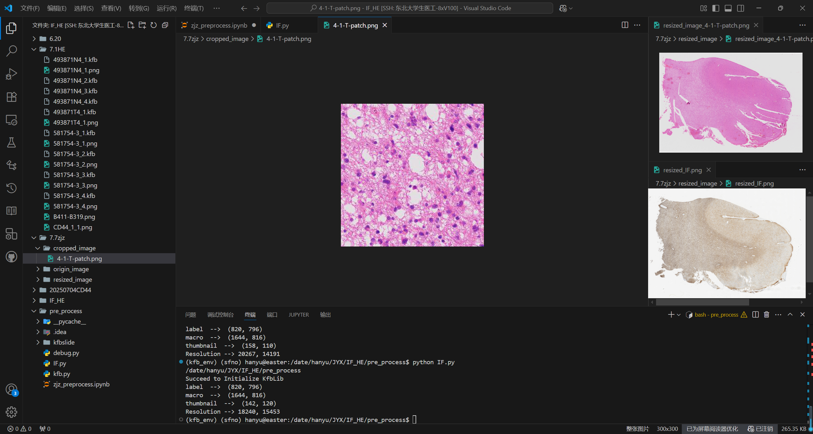

# if 配准到 He

## 先进行下采样

    import kfb
        
        KFB = kfb.kfb('/date/hanyu/JYX/IF_HE/7.1HE/581754-3_2.kfb')
        header = KFB.header()
        image = KFB.read(level=1)#
        plt.imsave(rootHE_dir+'581754-3_2.png', image)

        KFB = kfb.kfb('/date/hanyu/JYX/IF_HE/7.1HE/581754-3_3.kfb')
        image = KFB.read(level=1)
        plt.imsave(rootHE_dir + '581754-3_3.png', image)

        KFB = kfb.kfb('/date/hanyu/JYX/IF_HE/7.1HE/581754-3_4.kfb')
        image = KFB.read(level=1)
        plt.imsave(rootHE_dir+'581754-3_4.png', image)

其中使用环境kfb_env

先输入

    export LD_LIBRARY_PATH=/date/hanyu/JYX/IF_HE/pre_process/kfbslide/lib:$LD_LIBRARY_PATH

再进行

    KFB = kfb.kfb('/date/hanyu/JYX/IF_HE/7.1HE/581754-3_2.kfb')
    header = KFB.header()
    image = KFB.read(level=2)
    plt.imsave(rootHE_dir+'581754-3_2.png', image)

以此类推执行所有的切割

## 裁剪展示

裁剪其中一小部分展示细胞清晰度即可

## 放到本地进行配准

HE分辨率：20267*14191

IF分辨率：31384*15737->resized to 20267*14191

FIJI-》Bigwarp-》配准

